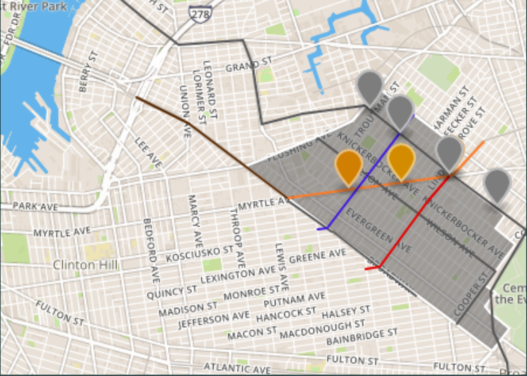

## Bushwick Neighborhood Summary

Zip Codes- 11206, 11207, 11221, and 11237
Census Tracts- 0389.00 – 0447.00

Demographics

Area- 1.305 Miles
Population- 114,134 (52.4% Female and 47.6% Male)
Population Density- 65,452 people per square mile
Average Income (Ages 25-64) - $36,320
Ethnicity- 65% Hispanic, 20% Black, 9% White, 5% Asian, 1% Other

30% of people below the poverty line with 17% unemployed

### Bushwick Outline

